

  

  
   

 [简体中文](/) |  [English ](/) 

# **大学生实习就业信息管理模块**

| **审签记录** |            |              |          |          |          |              |
| ------------ | ---------- | ------------ | -------- | -------- | -------- | ------------ |
| **版本号**   | **修订人** | **修订内容** | **校队** | **审核** | **批准** | **签批日期** |
| 1.0.0        | WEI.ZHOU   | 编写主体内容 |          |          |          |              |
| 1.1.0        | WEI.ZHOU   | 添加结果说明 |          |          |          |              |
|              |            |              |          |          |          |              |

# 1引言

## 1.1编写目的

为了完成大学生实习就业信息管理模块，将相关的模块设计形成文档，完成对项目的分解和需求定义，因项目和时间关系，将大学生实习就业信息管理模块完整设计整理成“大学生实习就业信息管理模块”系统设计说明书，最终呈现项目的完整流程和实现方案。

本阶段已在系统的概要设计说明书的基础上，对“大学生实习就业信息管理模块”模块做详细设计。主要解决了实现该系统需求的程序模块的具体功能实现问题。包括如何把该系统划分成若干个模块、决定各个模块之间的接口、模块之间传递的信息，以及数据结构、模块结构的设计等。在以下的详细设计报告中将对系统的功能进行详细设计说明。

## 1.2背景

“大学生实习就业信息管理模块”是一种针对高校大四的实习信息管理，无需下载安装即可使用的应用，能以最低成本触达用户。目前进行实习的大学生人数不断增加，每年要参加实习的大学生数量逐步增加，很多高校的为了管理学生的实习情况基本上都是通过Excle表格进行管理，如果有需要修改的需要老师打开表格进行数据的修改，老师长时间工作上课，可能会推迟信息的更新，没办法及时更新。需要回到办公室打开电脑进行表格修改，严重点可能会遗忘。

基于这个背景，本模块主要针对宜宾学院进行模块开发。在与毕业班的辅导员进行沟通时，了解到现在对学生实习管理都是通过在线表格进行管理，在线表格在一定意义上确实可以解决信息修改的实时性，但是会出现信息安全问题，还可能会出现个人实习信息被别人随意修改。考虑到以上几点不足，并结合宜宾学院的智慧校园进行了“大学生实习就业信息管理模块”的开发，通过实习就业以web服务进行管理，在一定程度上解决了数据安全与信息的实时性问题。并且实习就业信息还会进行数据统计等功能，可以更好的展示相关统计数据。

# 2系统概述

## 2.1系统说明

“大学生实习就业信息管理模块”系统详细完整记录带班老师下所有的学生实习就业信息，考虑到学生的人员变动，可以使用系统的excle导库的信息快捷导入学生数据，解决了数据量多后，数据录入系统的繁琐。实习信息管理系统在对信息的基本管理的基础上还可以实现数据统计、分析和汇总的功能。

## 2.2功能定义

通过前面阶段的分析和了解，结合实习信息管理实际问题，综合得出以下功能点，见表2-2-1所示。

|                  |                     |            |
| ---------------- | ------------------- | ---------- |
| 表2-2-1 系统功能 |                     |            |
| **功能需求**     | **功能点**          | **优先级** |
| 登录认证         | 实习信息管理登录    | 高         |
| 登录认证         | 找回密码            | 中         |
| 数据处理         | 实习信息统计        |            |
| 数据处理         | 实习信息汇总        | 高         |
| 数据处理         | 实习信息计算        | 高         |
| 学生信息         | 学生信息查询、修改  | 高         |
| 学生信息         | 学生信息删除、导库  | 高         |
| 实习信息         | 实习信息查询，新增  | 高         |
| 实习信息         | 实习信息删除、修改  | 高         |
| 实习信息         | 批量数据导库        | 中         |
| 系统性能         | 支持1000/秒并发请求 | 中         |

# 3系统架构设计

## 3.1系统功能框架设计

以图形和文字等形式形象得描述系统的整体物理架构模型，解释系统组成结构，重要节点，及其之间的物理联系方式，具体框架见图3-1-1所示

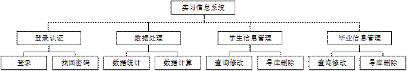

图3-1-1 毕业信息管理，系统功能框架设计

 

## 3.2系统技术框架设计

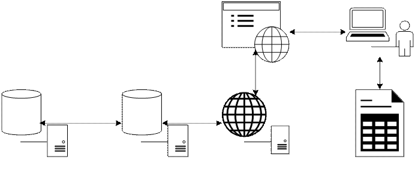

图3-2-1 大学生实习就业信息管理模块，系统技术框架设计

系统技术框架采用目前市场上热门高效的开发技术，通过技术如图 3-2-1，表3-2-2所示。

|                          |              |                                    |
| ------------------------ | ------------ | ---------------------------------- |
| 表3-2-2 系统架构技术说明 |              |                                    |
| **序号**                 | **技术点**   | **说明**                           |
| 1                        | Java Servlet | 系统后端业务处理                   |
| 2                        | Eachers      | 数据可视化                         |
| 3                        | Layui        | 页面开发                           |
| 4                        | API Service  | 提供安全稳定的网站服务             |
| 5                        | Mysql        | 关系型数据库，安全的数据持久化服务 |
| 6                        | Nginx        | 提供服务端容器负载均衡策略等操作   |

# 4程序系统的结构

下面以结构图来描述答题系统的软件总体结构。框内注明了模块的名字，方框之间

的直线表示模块的调用关系。如图4-1-1，图4-1-2所示。

 

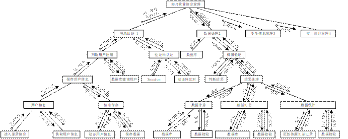

图4-1-1 大学生实习就业信息管理系统结构图

 

 

图4-1-2 续图 大学生实习就业信息管理模块学生信息管理结构图

 

 

图4-1-2 续图 大学生实习就业信息管理模块实习信息管理结构图

 

# 5界面功能设计

## 5.1前端功能框架设计

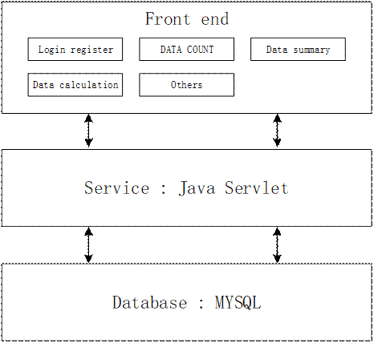

 

图5-1-1 实习信息管理系统功能框架

## 5.2前端技术框架设计

前端所采用基于JSP Servlet进行二次开发的界面技术，通过JSP技术可以-高效，便捷开发。系统可以灵活进行维护，技术框架参考图5-2-1所示。

 

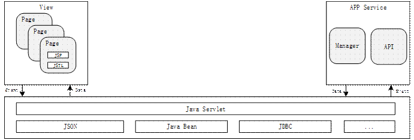

 

图5-2-1 实习信息系统技术框架

## 5.3前端界面布局设计

前端基于Layui进行界面设计布局，更具用户需求设计适合广大用户使用习惯。页面采用高颜色反差色调，单需要注意颜色不能过于刺激，太关于鲜艳会影响用户操作体验。见图6-3-1界面色块设计。

随着信息社会的高速发展，智能全面屏手机大规模普及，特别在学生群体中，大部分手机屏幕分辨率由起初的16:9发展到现在的18:9分辨率手机屏幕。我们针对现阶段普及的手机分辨率设计新的答题界面及部分使用频率高的组件，可参考图5-3-2界面组件设计。

 

图 5-3-1 界面色块设计

 

 

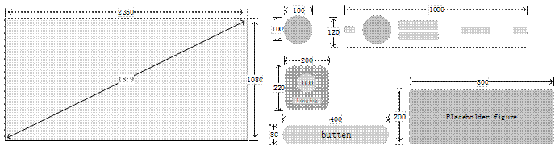

图 5-3-2 界面组件设计

 

## 5.4系统登录页面布局设计

实习信息管理系统首页，提供提示加载效果，通过首页的加载可以进行系统用户登录授权确认，系统使用协议确认的操作，如果用户不进行登录授权获取用户权限，将无法进入系统，只有通过登录授权，确认等操作才可以进行实习管理系统；用户登录系统会进行登录授权，登录授权界面参考图5-3-2所示。

 

图5-3-2 系统登录授权界面设计

 

## 5.5系统主页设计

实习信息管理主页界面的布局设计需要重点突出数据统计的可视化效果；在进用户老师登录成功进入主页可以直观了解到最新的实习数据信息，主页进行展示的数据包括学生总人数，及考研、考公、实习和待定的人数，通过直观的数据可以了解到带班学生的实习情况，不需要进行数据筛选即可。还有对应实习城市分布图图，了解到学生就业实习的分布范围，也方便进行管理。参考图5-5-1实习信息管理布局设计所示。

 

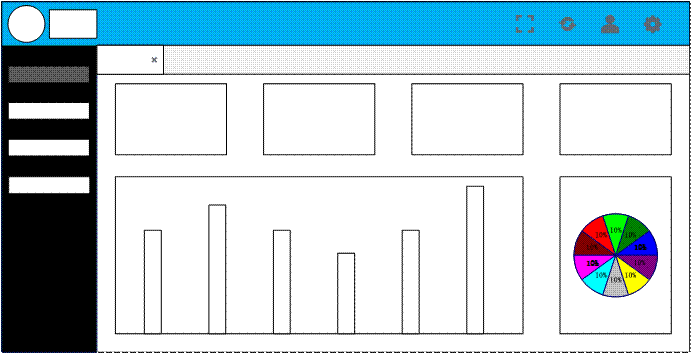

图 5-5-1 实习信息管理界面布局设计

 

 

## 5.6学生信息管理界面布局设计

学生信息管理界面在设计考虑到了老师带班会对学生信息进行管理，可以批量删除、修改信息、新增学生信息等基本功能。但是在对比许多系统都发现没办法进行数据导出，打印等功能，我们系统提供数据的一键导出打印等功能，关于数据，如果老师需要新增大量的学生数据怎么办，考虑到数据量大，我们提供了导库数据模板，只需要将学生信息复制在导库模板中就可以一间导入学生数据。上面的对学生的信息管理功能都完整集成在页面中，并提供了合理的布局设计。具体布局设计参考图5-6-1学生信息管理布局设计。

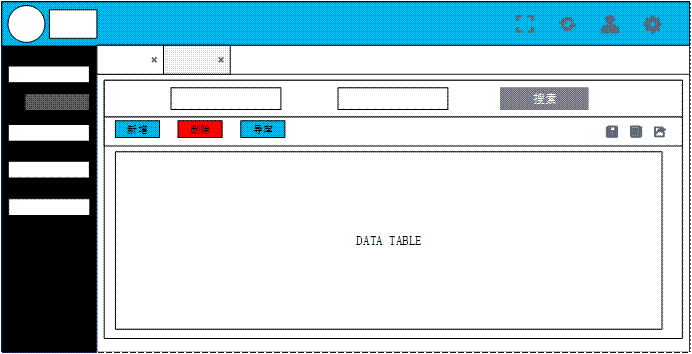

图 5-6-1学生信息管理布局设计

 

## 5.7实习信息页面布局设计

实习信息管理界面在设计考虑到了老师带班会对带班学生实习情况信息进行管理，可以批量删除、修改信息、新增新的学生实习信息等基本功能。但是在对比许多系统都发现没办法进行数据导出，打印等功能，“大学生实习就业信息管理模块”系统提供数据的一键导出打印等功能，关于数据，如果老师需要新增大量的学生就业实习信息数据怎么办，考虑到数据量大，我们提供了导库数据模板，老师只需要下载指定的导库模板在将需要将学生信息复制在导库模板中就可以一间导入学生实习数据。界面中的对学生的实习信息管理功能都完整集成在页面中，并提供了合理的布局设计。对需要重点关注的实习状态进行颜色标注进行显示，方便带班老师可以直观获得需要进行关注了解的学生实习信息管理界面设计入图5-7-1所示。

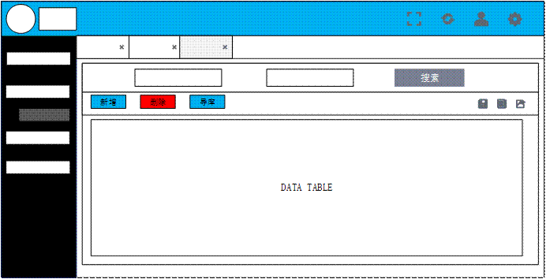

图 5-7-1 过度页面布局设计

## 5.8答题界面布局设计

导库数据表格模板获取界面，页面中通过表格的方式将系统需要进行数据导入的所有的数据表进行统计整理，方便用户快速选择需要进行导库的表格，添加学生相关数据。考虑到数据导库模板的统一，系统统一了所有的导库模板，这样方便数据的导入，减少了导库数据的频繁的修改。对模板的下载次数没有限制，方便老师随时随地都可以进行数据导入管理等。详细界面设计参考图5-8-1导库模板界面布局设计。

 

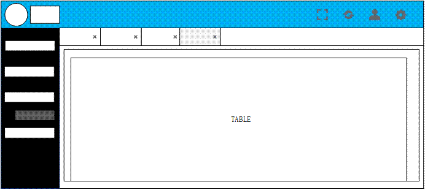

图 5-8-1导库数据模板布局设计

# 6服务端程序设计

## 6.1系统功能框架

### 6.1.1系统功能框架

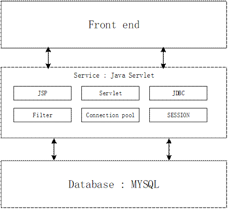

图 6-1-1 系统功能框架设计

 

---------------------- 更多文档内容查看请查看简陋的文档 [简单开发文档](/context) --------------------------------

 

 

# 9性能优化设计

## 9.1界面优化设计

模块的引入与处理模块之间的依赖关系以及解决命名冲突问题，并使用模块化方案来使复杂系统分解为代码结构更合理，可维护性更高的可管理的模块。在界面设计时加入等待加载等动画，极大程度上提示给用户友好的提示，如图9-1所示。

图 9-1 界面加载优化

 

## 9.2服务接口程序优化

将服务接口的所有日志文件进行汇总整理处理。线程数是一个重点，初始线程数和最大线程数，初始线程数保障启动的时候，如果有大量用户访问，能够很稳定的接受请求，最大线程数量用来保证系统的稳定性，而超时时间用来保障连接数不容易被压垮，如果大批量的请求过来，延迟比较高，不容易把线程打满。这种情况在生产中是比较常见的一旦网络不稳定，宁愿丢包也不愿意把机器压垮。

 

# 10系统运行结果

## 10.1功能结果

实习信息管理模块系统，在设计之初有登录权限验证功能、数据处理功能、学生信息管理和实习信息管理功能。本地化软件的功能测试，用于验证应用程序或网站对目标用户能正确工作。使用适当的平台、浏览器和测试脚本，以保证目标用户的体验将足够好，就像应用程序是专门为该市场开发的一样。功能测试是为了确保程序以期望的方式运行而按功能要求对软件进行的测试，通过对一个系统的所有的特性和功能都进行测试确保符合需求和规范。

功能测试也叫黑盒测试或数据驱动测试，只需考虑需要测试的各个功能，不需要考虑整个软件的内部结构及代码.一般从软件产品的界面、架构出发，按照需求编写出来的测试用例，输入数据在预期结果和实际结果之间进行评测，进而提出更加使产品达到用户使用的要求。

### 10.1.1登录鉴权结果

“大学生实习就业信息管理模块”的登录鉴权功能提供了账号与密码的身份验证登录，还包括简单的验证码验证，在进行登录身份验证时，前端先进行输入内容的验证。要求输入内容不能为空，如果为空就需要进行警告提示；判断输入内容不为空还需要多输入的账号长度、密码长度进行验证。不能满足登录要求依然警告提示用户。

 

图 10-1 登录鉴权结果

 

### 10.1.2数据处理结果

“大学生实习就业信息管理模块”的数据处理主要就是对学生实习情况分类进行统计汇总，还有就是将统计的数据进行可视化展示、展示实习的热门城市。方便带班老师对学生实习情况的了解与管理。

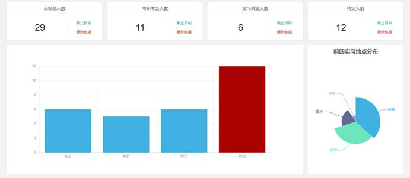

图 10-2 数据处理结果

### 10.1.3学生信息管理结果

学生信息管理模块主要的功能时进行数据到导入导出、还有对学生信息的修改，删除等功能。进行学生信息的导库操作时需要主要数据格式的要求，一定请下载对应的导库数据模板如图10-5所示。将最新的数据更新到excle导库文档中进行快速数据的导入。

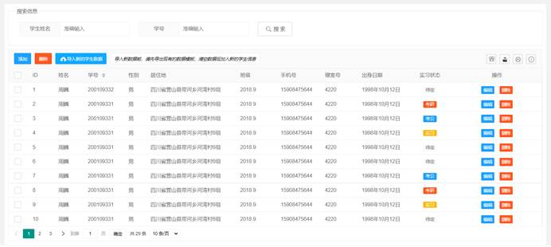

图 10-3 学生信息管理结果

### 10.1.4实习信息管理结果

实习信息管理模块主要的功能时进行数据到导入导出、还有对学生实习信息的修改，删除等功能。进行学生实习信息的导库操作时需要主要数据格式的要求，一定请下载对应的导库数据模板如图10-5所示。将最新的数据更新到excle导库文档中进行快速数据的导入。

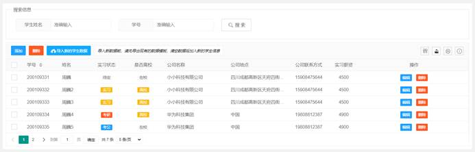

图 10-4 学生实习信息管理结果

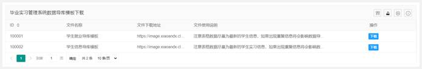

图 10-5 学生实习信息管理导库数据格式模板

 

### 10.1.5数据添加修改

实习信息与学生信息管理模块系统的数据添加的功能与业务一致，区别在于数据提交的数据内容不一致。

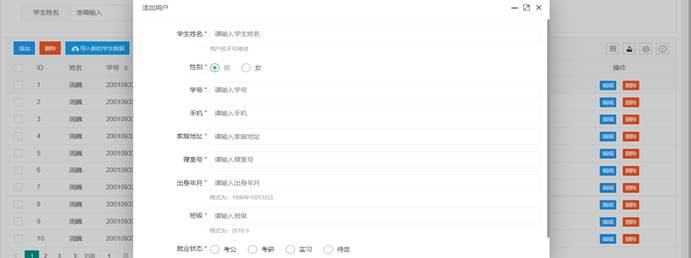

图 10-6 学生实习信息管理添加

